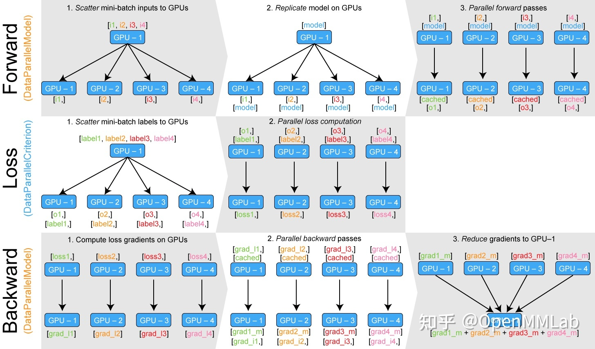

## Pytorch中 DataParallel 和 DistributedDataParallel 源码解读
### DataParallel
数据并行数学计算上有效, 并且可以加速训练

所参考和转载的文章:
- [Pytorch中DP和DDP的源码解读-OpenMMLab](https://zhuanlan.zhihu.com/p/343951042)

#### 1. DP的使用
```python
import torch.nn as nn
model = ...
model = nn.DataParallel(model) # gpu > 1
```

#### 2. Theory
DP基于单机多卡的原理, 所参与的所有设备都负责计算和训练网络, `device[0]`（输入参数device_ids的首位）负责整合梯度, 更新参数

整体的训练流程如下:
- 参与训练的各卡分别计算损失和梯度
- 所有梯度整合到`device[0]`
- `device[0]`进行参数更新, 其他卡拉取`device[0]`的参数进行更新

#### 3. Pytorch Code
Pytorch的源码实现
```python
class DataParallel(Module):

    def __init__(self, module, device_ids=None, output_device=None, dim=0):
        super(DataParallel, self).__init__()

        # 检查是否有可用的 GPU
        device_type = _get_available_device_type()
        if device_type is None:
            self.module = module
            self.device_ids = []
            return
        
        # 默认使用所有可见的 GPU
        if device_ids is None:
            device_ids = _get_all_device_indices()

        # 默认 server 是 device_ids 列表上第一个
        if output_device is None:
            output_device = device_ids[0]

        self.dim = dim
        self.module = module
        self.device_ids = list(map(lambda x: _get_device_index(x, True), device_ids))
        self.output_device = _get_device_index(output_device, True)
        self.src_device_obj = torch.device(device_type, self.device_ids[0])

        # 检查负载是否平衡， 不平衡（指内存或者处理器 max/min > 0.75 会有警告）
        _check_balance(self.device_ids)

        # 单卡
        if len(self.device_ids) == 1:
            self.module.to(self.src_device_obj)

    def forward(self, *inputs, **kwargs):

        # 没 GPU 可用
        if not self.device_ids:
            return self.module(*inputs, **kwargs)

        # 运行前 GPU device_ids[0] （即我们的 server ）上必须有 parallelized module 的parameters 和 buffers
        # 因为 DP 保证 GPU device_ids[0] 和 base parallelized module 共享存储
        # 所以在device[0] 上的 in-place 更新也会被保留下来，其他的则不会

        for t in chain(self.module.parameters(), self.module.buffers()):
            if t.device != self.src_device_obj:
                raise RuntimeError("module must have its parameters and buffers "
                                   "on device {} (device_ids[0]) but found one of "
                                   "them on device: {}".format(self.src_device_obj, t.device))

        # nice 现在 device[0] 上已经有了 module 和 input， 接下来我们就要开始 PS 算法了
        # 可以开始看正文了

        inputs, kwargs = self.scatter(inputs, kwargs, self.device_ids)

        # 如果仅有单卡可用，直接单卡计算，不用并行
        if len(self.device_ids) == 1:
            return self.module(*inputs[0], **kwargs[0])

        replicas = self.replicate(self.module, self.device_ids[:len(inputs)])
        outputs = self.parallel_apply(replicas, inputs, kwargs)
        return self.gather(outputs, self.output_device)

    def replicate(self, module, device_ids):
        return replicate(module, device_ids, not torch.is_grad_enabled())

    def scatter(self, inputs, kwargs, device_ids):
        return scatter_kwargs(inputs, kwargs, device_ids, dim=self.dim)

    def parallel_apply(self, replicas, inputs, kwargs):
        return parallel_apply(replicas, inputs, kwargs, self.device_ids[:len(replicas)])

    def gather(self, outputs, output_device):
        return gather(outputs, output_device, dim=self.dim)
```
重要函数解析(这里只对其功能进行解析, 更加详细的解析可以参考OpenMMLab的文章):
- scatter函数: 调用`scatter_kwargs`: 将`tensor`分成`大概相等的块`, 并将他们分给不同的GPU. 对于其他的数据类型, 则`复制`一份给其他GPU
- replicate函数: 负责拷贝`网络`及`参数`, 调用`parallel_apply`启动多线程操作,将参数数据分发到多个卡上, 这个函数为`DP`和`DDP`共享
- gather函数: 将所有卡的结果收集到`device[0]`更新结果.

可视化如下（引用自OpenMMLab的知乎文章):

- Forward:
  - Scatter mini-batch `inputs` to GPUs
  - `Replicate model` on GPUs
  - `Parallel forward` passes
- Loss Computation:
  - Scatter mini-batch `labels` to GPUs
  - `Parallel loss` computation
- Backward:
  - Compute loss gradients on each GPU
  - `Parallel backward` passes
  - Reduce gradients to GPU-1(`device[0]`)

#### 4. 分析
- 负载不均衡: device[0]的负载相对较大, 因为需要负责整合梯度
- 通信开销: 假设K个GPU, 完成一次通信需要的时间为`p/b`, 那么使用PS算法, 总共需要花费时间 `T = 2(k-1)p/b`
